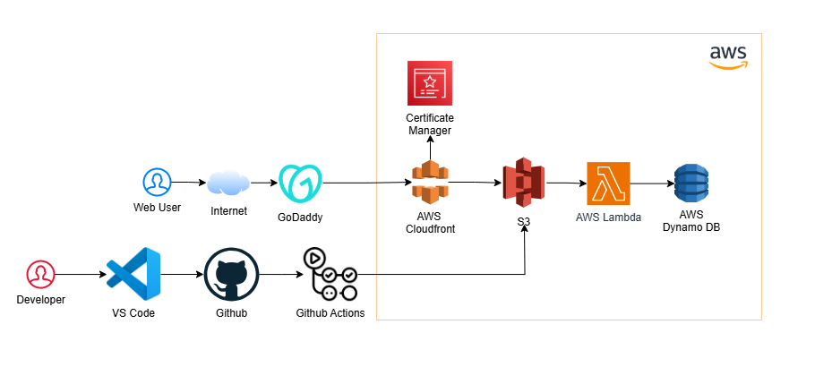

**Welcome to my Cloud Resume Challenge!** This project showcases my hands-on experience with cloud technologies, DevOps practices, and automation. The objective of this project is to build a static personal resume website hosted on the cloud, integrate serverless backend services, and implement a Continuous Integration/Continuous Deployment (CI/CD) pipeline.

**Overview**
This project demonstrates the use of cloud services to host a personal resume website. It includes the following:

- Static Website Hosting using AWS S3.
- Custom Domain setup with GoDaddy.
- SSL Encryption for secure HTTPS access using AWS Certificate Manager (ACM).
- Visitor Counter implemented using AWS Lambda and DynamoDB.
- CI/CD Pipeline using AWS GitHub Actions.
